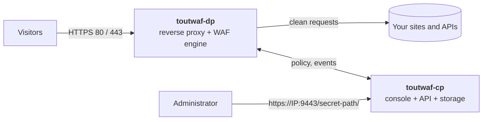

<div align="center">

# ToutWAF

**Self-hosted web application and API protection (WAAP): shields your sites and APIs, with a web console in 10 languages.**

WAF · API protection · anti-bot · layer-7 anti-DDoS · reverse proxy · encrypted backups

[Install](#installation) · [Features](#features) · [Screenshots](#screenshots) · [Architecture](#architecture) · [First start](#first-start) · [Français](README.md)

**Version 0.2.0-dev.8** · channel **dev (pre-release)** · 2026-10-05

</div>


---

## What is ToutWAF?

ToutWAF sits **in front of your websites and APIs** and inspects every request before it reaches your application: SQL injection, XSS, command execution, malicious bots, volumetric attacks, data leaks in responses... Clean requests go through, the others are blocked, and every decision is **explained** in the console with the rule that fired.

It installs on **your own server** (Linux or Windows), with no cloud service: your traffic data stays with you.

> **Beta channel.** This `dev` branch carries test releases (`X.Y.Z-dev.N`). For production use the [`main`](https://github.com/qu3ntin01/toutwaf/tree/main) branch (stable channel).

> This repository publishes ToutWAF **installers and binaries only**. It contains no source code.

## Features

**Web application protection**
- Detection of SQL and NoSQL injection, XSS, command injection, file inclusion and path traversal, SSRF, XXE, template injection, deserialization, Log4Shell and Spring4Shell, CRLF, request smuggling, dangerous file uploads.
- Rule engine compatible with the ModSecurity language (SecLang), paranoia levels 1 to 4, anomaly scoring, virtual patches for CVEs, custom rules in a readable language with a visual editor.
- **Detect first, block later**: see what would be blocked, create narrow exceptions in one click, simulate a rule before enabling it, roll out gradually (1% / 10% / 100%), and roll back in one click.

**API protection**
- OpenAPI and GraphQL validation, JWT checks, API keys and quotas, per-consumer rate limiting, detection of data leaks (card numbers, IBAN, secret keys) in responses.

**Bots and volumetric attacks**
- Bot score, invisible JavaScript challenge (proof of work), built-in CAPTCHA, TLS fingerprints (JA3/JA4), verified legitimate crawlers, AI-crawler policy.
- Multi-key rate limiting, progressive automatic bans, "I'm under attack" mode, protection against slow connections and HTTP/2 abuse.

**Access control**
- IP and network lists, countries and ASNs, IP reputation, Tor/VPN/hosting detection, restriction of admin areas.

**Reverse proxy**
- TLS 1.2/1.3, HTTP/2, WebSocket, load balancing, health checks, cache, compression, automatic certificates (Let's Encrypt / ZeroSSL).

**Administration console**
- **10 languages** (French, English, Spanish, German, Italian, Portuguese, Dutch, Russian, Chinese, Arabic); **7 themes**, a custom accent colour, a default *Aurora* look (light, blue accent, Plus Jakarta Sans font) and a menu whose sections start folded.
- Live events with search, an explanation of every decision, a "false positive" button, policy versions with rollback, roles and permissions, two-factor authentication, SSO, audit log, REST API.
- Secure access: secret link, one-time setup link, changeable account and password.
- **Product updates from the console**: pick the `stable` or `dev` channel, get an instant notice (top-bar pill, banner, toast) as soon as a version is published (checked about every 5 minutes), read the release notes and click **Update now** to follow a live progress; if the new version does not start, the previous one is restored automatically.
- **First-run wizard** you can skip, with help next to the origin URL field and a **stack detection** that shows the layers found (web server, language, framework, CMS...), a confidence level and the evidence behind each guess.

**Operations**
- **Encrypted backups** with off-site copies (S3-compatible, SFTP, WebDAV), retention and automatic restore tests.
- Alerts and integrations (SIEM, Slack, Teams, e-mail, PagerDuty...), Prometheus metrics, multi-organisation.
- **Host firewall**: on Linux the installer opens the ports ToutWAF needs when firewalld or ufw is active, and **Settings → Firewall** shows the state of each port and opens the missing ones.

## Screenshots

| | |
|---|---|
|  **Events**: every request, explained |  **Sites**: protection and score per site |
|  **Rules**: modes, exceptions, simulation |  **Backups**: encrypted, off-site copies |
|  **Cluster**: your servers, security score and alerts |  **Server dashboard**: live resources, fixes, terminal |
|  **Setup assistant**: checks ports 80/443, certificates and the data plane |  **Definitions**: 19 sources updated automatically every hour |

**Fully customisable: several themes, light or dark mode, your own accent colour** (Settings → Appearance). The default look is *Aurora* in light mode with a blue accent:


| Aurora (dark) | Nordic | Executive |
|---|---|---|
|  |  |  |

| Obsidian | Ember |
|---|---|
|  |  |

> Screenshots taken with demonstration data (the console shown in French).

## Architecture



| Component | Role |
|---|---|
| **`toutwaf-dp`** (data plane) | Receives the traffic, inspects every request and response, applies the policy. It **keeps protecting even if the console is down** (last policy cached). |
| **`toutwaf-cp`** (control plane) | Web console, REST API, versioned policies, accounts and permissions, events, backups, certificates. |
| **`toutwafctl`** | Command line: sites, policies, bans, backups, diagnostics. |

One server is enough to install everything; you can also put several `toutwaf-dp` behind a load balancer, all driven by a single `toutwaf-cp`.

## Installation

### Requirements

| | Linux | Windows |
|---|---|---|
| System | x86_64 or **64-bit ARM (aarch64, Raspberry Pi 3/4/5 and Zero 2 W with a 64-bit OS)**, with systemd. **Validated** (x86_64): AlmaLinux 10, Rocky Linux 9, Debian 12.. The arm64 build is [not yet tested on real hardware](#known-limitations); 32-bit ARM (armv7) is not supported | Windows 10/11 or Windows Server, x64 or **ARM64 (Windows on ARM, never run: build cross-compiled and header-checked only)** (installer [not yet validated on a real Windows host](#known-limitations)) |
| Resources | 1 GB RAM, 2 GB disk | same |
| Rights | `root` (sudo) | **Administrator** PowerShell |
| Network | ports **80** and **443** free (protected sites), port **9443** (console); opened for you in firewalld or ufw, see below | same (Windows Defender Firewall rules created by the installer) |
| Location | a single home, `/var/toutwaf` (`bin`, `conf`, `data`, `logs`), changeable with `--home DIR` | `%ProgramFiles%\ToutWAF`, data in `%ProgramData%\ToutWAF` |

### Linux

```sh
curl -fsSL https://raw.githubusercontent.com/qu3ntin01/toutwaf/dev/install.sh | sudo bash
```

An **interactive menu** is shown (install, update, uninstall, status, show links) with a description of every option. The installer downloads the binaries, **verifies their SHA-256 checksum**, creates a dedicated system user, installs hardened `systemd` services, opens the firewall ports (see below), and finally prints the **summary** (see [First start](#first-start)).

Unattended installation:

```sh
curl -fsSL https://raw.githubusercontent.com/qu3ntin01/toutwaf/dev/install.sh | sudo bash -s -- --install --yes --public-host waf.example.com --console-from 203.0.113.0/24
```

Main options: `--component dp|cp|all`, `--channel stable|dev`, `--version X.Y.Z`, `--public-host`, `--home DIR`, `--no-firewall`, `--console-from CIDR`, `--lang en`, `--tarball FILE` (offline), `--dry-run`. All options: `install.sh --help`.

**Where things go.** A fresh Linux installation uses one home, `/var/toutwaf`, with `bin/`, `conf/`, `data/` and `logs/` below it (`--home DIR` or `TOUTWAF_HOME` to choose another one); the command-line tools (`toutwafctl`, `toutwaf-cp`, `toutwaf-dp`) are linked in `/usr/local/bin`. An installation made before this layout keeps its paths (`/etc/toutwaf`, `/var/lib/toutwaf`, `/var/log/toutwaf`, binaries in `/usr/local/bin`) and is **never moved**.

**Firewall.** When firewalld or ufw is active, the installer opens what the installed components need by default: 80 and 443 for a data plane and the console port (9443) for a control plane. `--console-from CIDR` lets only that address or network reach the console (`0.0.0.0/0` is refused), and `--no-firewall` leaves the firewall alone. The agent port 9444 is **never** opened publicly: allow it only from your own servers. On hosts that use nftables or iptables only, the installer changes nothing and prints the exact commands. Later, **Settings → Firewall** in the console shows the ports and can open the missing ones.

To attach an **additional server** (data plane only) to an existing console:

```sh
curl -fsSL https://raw.githubusercontent.com/qu3ntin01/toutwaf/dev/install.sh | sudo bash -s -- --install --component dp --cp-url https://console.example.com:9444 --enroll-token TOKEN --yes
```

### Windows

In PowerShell, **as administrator**:

```powershell
irm https://raw.githubusercontent.com/qu3ntin01/toutwaf/dev/install.ps1 | iex
```

With options:

```powershell
& ([scriptblock]::Create((irm https://raw.githubusercontent.com/qu3ntin01/toutwaf/dev/install.ps1))) -Install -PublicHost waf.example.com
```

### Update, check, uninstall

```sh
curl -fsSL https://raw.githubusercontent.com/qu3ntin01/toutwaf/dev/install.sh | sudo bash -s -- --update      # update (backup first, automatic rollback on failure)
curl -fsSL https://raw.githubusercontent.com/qu3ntin01/toutwaf/dev/install.sh | sudo bash -s -- --status      # health check
curl -fsSL https://raw.githubusercontent.com/qu3ntin01/toutwaf/dev/install.sh | sudo bash -s -- --links       # show the access links again
curl -fsSL https://raw.githubusercontent.com/qu3ntin01/toutwaf/dev/install.sh | sudo bash -s -- --uninstall   # uninstall (add --purge to erase everything)
```

## First start

At the end of the installation the installer prints a box with everything you need:

1. **The secure console link**, shaped like `https://<IP>:9443/<secret-path>/`, given for **every local address and for the public address**. The secret path is random: any other address on port 9443 returns a neutral 404 page.
2. **The administrator user name and password**, generated and **shown only once**.
3. **A one-time setup link** that opens a wizard to choose your own secret link, user name and password.
4. **The ports** the installer opened, and the exact commands for the ones you must open yourself (nftables, iptables, `--no-firewall`). Don't forget your hosting provider's security group.

The same summary is saved in `/var/toutwaf/conf/INSTALL-SUMMARY.txt` (readable by `root` only). The secret link, user name and password can then be **changed in Settings → Access** and **My account**.

| Port | Use | Open it? |
|---|---|---|
| 80 and 443 / TCP | Traffic of the protected sites (`toutwaf-dp`) | Yes |
| 9443 / TCP | Administration console (`toutwaf-cp`) | Opened by the installer; ideally restricted to your admin network (`--console-from`) |
| 9444 / TCP | Enrolment of remote `toutwaf-dp` servers and host agents | Never opened publicly by the installer: allow it only from your own servers |

**Protect your first site in 5 minutes:**

1. Open the console and follow the wizard (or skip it and add a site later from **Sites**): enter the **domain** and the address of your **origin server**; the help next to that field gives examples.
2. ToutWAF detects your stack (layers, confidence, evidence), proposes a policy template suited to it, and offers a **free certificate** (Let's Encrypt).
3. The site starts in **detection mode**: nothing is blocked, everything is observed.
4. Point your DNS at ToutWAF, let it run for a few days, then read the **report** (what would have been blocked, likely false positives, proposed exceptions).
5. Switch to **blocking mode** in one click, with a one-click rollback.

Useful commands: `toutwafctl doctor` (diagnostics), `toutwaf-cp admin reset-password --user admin` (forgotten password), `toutwaf-cp setup-link --regenerate` (new setup link).

## Channels: stable and beta

| Channel | Branch | For whom | Default install |
|---|---|---|---|
| **stable** | [`main`](https://github.com/qu3ntin01/toutwaf/tree/main) | production | `…/main/install.sh` |
| **beta (dev)** | [`dev`](https://github.com/qu3ntin01/toutwaf/tree/dev) | testing, new features | `…/dev/install.sh` |

The installer remembers the chosen channel (`<home>/conf/installer.conf`); `--channel stable|dev` switches it. The channel can also be chosen on the **Updates** page of the console.

### Updating from the console

The **Updates** page (Administration menu) shows the installed version, the latest version of the selected channel and its release notes. The control plane checks the channel about every 5 minutes and the console announces a new version at once. **Update now** downloads the release, verifies its checksum, installs it and restarts the services **of that server**, with a live progress; if the new version does not start, the previous one is restored automatically. Nothing is offered when the channel is older than the installed version (no silent downgrade). Other data-plane servers are updated through the rolling campaigns of the console or by re-running the installer on them.

## Free edition

Without a licence ToutWAF runs as the **free edition**: **5 protected sites, 1 node, 2 users, 1 organisation and 50 million requests per month**. Going over the monthly request quota is flagged as "over quota" in the console. Adding more is refused until a licence is installed. Everything else described here is the same product; for larger limits, contact your ToutWAF vendor.


## Known limitations

Let's be transparent about what is not (yet) covered:

- **Platforms**: installation validated end to end on AlmaLinux 10, Rocky Linux 9 and Debian 12 with the binaries of this release; AlmaLinux 9 and Ubuntu 24.04 passed earlier runs on a previous build. Other distributions are untested. **Windows**: the host agent (cluster) is tested on a real Windows Server 2025 (audit, telemetry, Microsoft Defender scan, terminal); the Windows installer script itself is not yet validated end to end on a real host. **ARM64 (Raspberry Pi, Graviton, Ampere)**: the release carries a linux-arm64 package, cross-compiled and checked only under emulation (QEMU): start, health checks, proxied request, blocked SQL injection. It has **not been tested on real ARM hardware** and no performance figure is given. A Raspberry Pi needs a **64-bit** OS (Raspberry Pi OS 64-bit, Ubuntu or Debian arm64); 32-bit ARM (armv7, 32-bit Raspberry Pi OS) is not supported and the installer stops with a message. **Windows on ARM64**: the release carries a windows-arm64 package (cross-compiled; only the PE machine type 0xAA64 was checked), it has never been run on Windows on ARM.
- **Updates from the console** install on the server that runs the console, on Linux with systemd only (elsewhere, for example on Windows, the page shows the command to run); other nodes follow through update campaigns or the installer. **Firewall automation** covers firewalld and ufw (and Windows Defender Firewall rules created by the installer); with nftables or iptables you get the commands to run.
- **Not available yet**: HTTP/3, PostgreSQL (SQLite only), inspection of gRPC message contents.
- **Lightly tested**: SAML SSO (OIDC tested), the automatic hourly download of the OWASP CRS releases from GitHub over several days (the full CRS 4.31 ruleset itself is tested in our test rig), DNS-01 certificates with Cloudflare/OVH/Route 53, third-party integrations (SIEM, ticketing).
- **Detection**: measured with an independent tool (GoTestWAF: 673/673 attacks blocked, 0/141 false positives) and on a public payload set never seen during development (89.9 % raw; 99.95 % once non-attack fuzz fragments are removed, with the list of excluded fragments disclosed to our reviewers). No WAF catches everything: expect to tune exceptions for your applications. Known trade-offs: MongoDB-style operators (`$ne`, `$where`) in JSON/form fields and two or more `../` in a value are blocked.
- **Performance**: measured on a shared test machine (a few thousand requests per second per instance). Measure on your own hardware before going to production.
- Console and error-message translations were written with the help of automated tools and have not yet been reviewed by native speakers.
- No certification (ANSSI, PCI DSS, ISO 27001) is claimed.


## Versions and downloads

**Version 0.2.0-dev.8**

| File | OS | Arch | Size | SHA-256 |
|---|---|---|---:|---|
| `toutwaf-linux-amd64.tar.gz` | linux | amd64 | 42.5 MiB | `a9429bd7036ec2f045eacc33448153971c941c964691a4b8a668a64cbc52ffe2` |
| `toutwaf-linux-arm64.tar.gz` | linux | arm64 | 38.8 MiB | `a08b89a34cc25e3df1830d07251a2b0f2a2667a9af646c817f93b89871c9905e` |
| `toutwaf-windows-amd64.zip` | windows | amd64 | 43.0 MiB | `258b13ba5fc491637202932874c3167a0dbf1671cb4d8e212f01ac1b43c6074c` |
| `toutwaf-windows-arm64.zip` | windows | arm64 | 39.1 MiB | `d41bfce2fe64f3645d7cd7a1e07e4d0c3ddba07b90b73992e8f030ae42361a4c` |


| Version | Date | Status | Directory |
|---|---|---|---|
| `0.2.0-dev.8` | 2026-10-05T17:24:59Z | **current** | `releases/0.2.0-dev.8/` |
| `0.2.0-dev.7` | 2026-10-05T14:28:05Z | available | `releases/0.2.0-dev.7/` |
| `0.2.0-dev.6` | 2026-10-04T18:03:29Z | available | `releases/0.2.0-dev.6/` |
| `0.2.0-dev.5` | 2026-10-03T17:20:42Z | available | `releases/0.2.0-dev.5/` |
| `0.2.0-dev.4` | 2026-10-03T13:59:43Z | available | `releases/0.2.0-dev.4/` |

Release notes are in [CHANGELOG.md](CHANGELOG.md).

### Verify a download

Every release directory has a `SHA256SUMS` file; `channel.json` repeats the hashes of the current release. The installer checks them automatically. To verify by hand:

```sh
cd releases/0.2.0-dev.8 && sha256sum -c SHA256SUMS --ignore-missing
```

### Verify a release

From release 0.2.0-dev.7 on, each release directory also holds `SHA256SUMS.sig`: the base64 of the raw 64-byte Ed25519 signature of the exact `SHA256SUMS` file. The installers verify it by default with a public key built into the installer script (key id `f8fc98e4c6e364fa`) and refuse a release whose signature is invalid, or missing for 0.2.0-dev.7 and later; releases before 0.2.0-dev.7 were published unsigned (checksums only). The public key repeated in `channel.json` is informational and is never used to trust a release: take the key from the installer script or from your vendor. Public key (raw, base64): `PAevMh9+at71+DR2Tnmo2raHB5mgvltMCUds8nevudo=`. To verify by hand (OpenSSL 3 or later):

```sh
V=0.2.0-dev.8; R=https://raw.githubusercontent.com/qu3ntin01/toutwaf/dev/releases/$V
curl -fsSLO "$R/SHA256SUMS" -O "$R/SHA256SUMS.sig"
{ printf '\x30\x2a\x30\x05\x06\x03\x2b\x65\x70\x03\x21\x00'; echo 'PAevMh9+at71+DR2Tnmo2raHB5mgvltMCUds8nevudo=' | base64 -d; } | openssl pkey -pubin -inform DER -out release.pem
base64 -d SHA256SUMS.sig > sig.bin
openssl pkeyutl -verify -pubin -inkey release.pem -rawin -in SHA256SUMS -sigfile sig.bin   # "Signature Verified Successfully"
sha256sum -c SHA256SUMS --ignore-missing
```

A release signed with another key, or modified after signing, fails with "Signature Verification Failure". To trust another key (private mirror), set `TOUTWAF_RELEASE_PUBKEY` or create `<home>/conf/release.pub` before installing.

## License and support

ToutWAF is proprietary software: see [LICENSE](LICENSE). For support, commercial licensing or a security report, contact your ToutWAF vendor.
