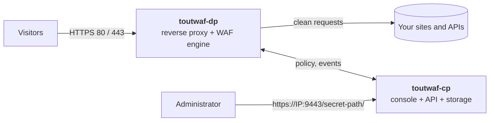

<div align="center">

# ToutWAF

**Self-hosted web application and API protection (WAAP): shields your sites and APIs, with a web console in 10 languages.**

WAF · API protection · anti-bot · layer-7 anti-DDoS · reverse proxy · encrypted backups

[Install](#installation) · [Features](#features) · [Screenshots](#screenshots) · [Architecture](#architecture) · [First start](#first-start) · [Français](README.md)

**Version 0.2.0-dev.4** · channel **dev (pre-release)** · 2026-10-03

</div>


---

## What is ToutWAF?

ToutWAF sits **in front of your websites and APIs** and inspects every request before it reaches your application: SQL injection, XSS, command execution, malicious bots, volumetric attacks, data leaks in responses... Clean requests go through, the others are blocked, and every decision is **explained** in the console with the rule that fired.

It installs on **your own server** (Linux or Windows), with no cloud service: your traffic data stays with you.

> **Beta channel.** This `dev` branch carries test releases (`X.Y.Z-dev.N`). For production use the [`main`](https://github.com/qu3ntin01/toutwaf/tree/main) branch (stable channel).

> This repository publishes ToutWAF **installers and binaries only**. It contains no source code.

## Features

**Web application protection**
- Detection of SQL and NoSQL injection, XSS, command injection, file inclusion and path traversal, SSRF, XXE, template injection, deserialization, Log4Shell and Spring4Shell, CRLF, request smuggling, dangerous file uploads.
- Rule engine compatible with the ModSecurity language (SecLang), paranoia levels 1 to 4, anomaly scoring, virtual patches for CVEs, custom rules in a readable language with a visual editor.
- **Detect first, block later**: see what would be blocked, create narrow exceptions in one click, simulate a rule before enabling it, roll out gradually (1% / 10% / 100%), and roll back in one click.

**API protection**
- OpenAPI and GraphQL validation, JWT checks, API keys and quotas, per-consumer rate limiting, detection of data leaks (card numbers, IBAN, secret keys) in responses.

**Bots and volumetric attacks**
- Bot score, invisible JavaScript challenge (proof of work), built-in CAPTCHA, TLS fingerprints (JA3/JA4), verified legitimate crawlers, AI-crawler policy.
- Multi-key rate limiting, progressive automatic bans, "I'm under attack" mode, protection against slow connections and HTTP/2 abuse.

**Access control**
- IP and network lists, countries and ASNs, IP reputation, Tor/VPN/hosting detection, restriction of admin areas.

**Reverse proxy**
- TLS 1.2/1.3, HTTP/2, WebSocket, load balancing, health checks, cache, compression, automatic certificates (Let's Encrypt / ZeroSSL).

**Administration console**
- **10 languages** (French, English, Spanish, German, Italian, Portuguese, Dutch, Russian, Chinese, Arabic); **7 themes** and a custom accent colour.
- Live events with search, an explanation of every decision, a "false positive" button, policy versions with rollback, roles and permissions, two-factor authentication, SSO, audit log, REST API.
- Secure access: secret link, one-time setup link, changeable account and password.

**Operations**
- **Encrypted backups** with off-site copies (S3-compatible, SFTP, WebDAV), retention and automatic restore tests.
- Alerts and integrations (SIEM, Slack, Teams, e-mail, PagerDuty...), Prometheus metrics, multi-organisation.

## Screenshots

| | |
|---|---|
|  **Events**: every request, explained |  **Sites**: protection and score per site |
|  **Rules**: modes, exceptions, simulation |  **Backups**: encrypted, off-site copies |
|  **Cluster**: your servers, security score and alerts |  **Server dashboard**: live resources, fixes, terminal |
|  **Setup assistant**: checks ports 80/443, certificates and the data plane | |

**Fully customisable: several themes, light or dark mode, your own accent colour** (Settings → Appearance). The default look is *Aurora* in light mode with a blue accent:


| Aurora (dark) | Nordic | Executive |
|---|---|---|
|  |  |  |

| Obsidian | Ember |
|---|---|
|  |  |

> Screenshots taken with demonstration data (the console shown in French).

## Architecture



| Component | Role |
|---|---|
| **`toutwaf-dp`** (data plane) | Receives the traffic, inspects every request and response, applies the policy. It **keeps protecting even if the console is down** (last policy cached). |
| **`toutwaf-cp`** (control plane) | Web console, REST API, versioned policies, accounts and permissions, events, backups, certificates. |
| **`toutwafctl`** | Command line: sites, policies, bans, backups, diagnostics. |

One server is enough to install everything; you can also put several `toutwaf-dp` behind a load balancer, all driven by a single `toutwaf-cp`.

## Installation

### Requirements

| | Linux | Windows |
|---|---|---|
| System | x86_64 with systemd. **Validated**: AlmaLinux 10, Rocky Linux 9, Debian 12. | Windows 10/11 or Windows Server, x64 (installer [not yet validated on a real Windows host](#known-limitations)) |
| Resources | 1 GB RAM, 2 GB disk | same |
| Rights | `root` (sudo) | **Administrator** PowerShell |
| Network | ports **80** and **443** free (protected sites), port **9443** (console) | same |

### Linux

```sh
curl -fsSL https://raw.githubusercontent.com/qu3ntin01/toutwaf/dev/install.sh | sudo bash
```

An **interactive menu** is shown (install, update, uninstall, status, show links) with a description of every option. The installer downloads the binaries, **verifies their SHA-256 checksum**, creates a dedicated system user, installs hardened `systemd` services, configures the firewall if you agree, and finally prints the **summary** (see [First start](#first-start)).

Unattended installation:

```sh
curl -fsSL https://raw.githubusercontent.com/qu3ntin01/toutwaf/dev/install.sh | sudo bash -s -- --install --yes --public-host waf.example.com --open-firewall
```

Main options: `--component dp|cp|all`, `--channel stable|dev`, `--version X.Y.Z`, `--public-host`, `--open-firewall`, `--lang en`, `--tarball FILE` (offline), `--dry-run`. All options: `install.sh --help`.

To attach an **additional server** (data plane only) to an existing console:

```sh
curl -fsSL https://raw.githubusercontent.com/qu3ntin01/toutwaf/dev/install.sh | sudo bash -s -- --install --component dp --cp-url https://console.example.com:9444 --enroll-token TOKEN --yes
```

### Windows

In PowerShell, **as administrator**:

```powershell
irm https://raw.githubusercontent.com/qu3ntin01/toutwaf/dev/install.ps1 | iex
```

With options:

```powershell
& ([scriptblock]::Create((irm https://raw.githubusercontent.com/qu3ntin01/toutwaf/dev/install.ps1))) -Install -PublicHost waf.example.com
```

### Update, check, uninstall

```sh
curl -fsSL https://raw.githubusercontent.com/qu3ntin01/toutwaf/dev/install.sh | sudo bash -s -- --update      # update (backup first, automatic rollback on failure)
curl -fsSL https://raw.githubusercontent.com/qu3ntin01/toutwaf/dev/install.sh | sudo bash -s -- --status      # health check
curl -fsSL https://raw.githubusercontent.com/qu3ntin01/toutwaf/dev/install.sh | sudo bash -s -- --links       # show the access links again
curl -fsSL https://raw.githubusercontent.com/qu3ntin01/toutwaf/dev/install.sh | sudo bash -s -- --uninstall   # uninstall (add --purge to erase everything)
```

## First start

At the end of the installation the installer prints a box with everything you need:

1. **The secure console link**, shaped like `https://<IP>:9443/<secret-path>/`, given for **every local address and for the public address**. The secret path is random: any other address on port 9443 returns a neutral 404 page.
2. **The administrator user name and password**, generated and **shown only once**.
3. **A one-time setup link** that opens a wizard to choose your own secret link, user name and password.
4. **The ports to open** in the firewall, with the exact commands (`firewalld`, `ufw`, Windows). Don't forget your hosting provider's security group.

The same summary is saved in `/etc/toutwaf/INSTALL-SUMMARY.txt` (readable by `root` only). The secret link, user name and password can then be **changed in Settings → Access** and **My account**.

| Port | Use | Open it? |
|---|---|---|
| 80 and 443 / TCP | Traffic of the protected sites (`toutwaf-dp`) | Yes |
| 9443 / TCP | Administration console (`toutwaf-cp`) | Yes, ideally restricted to your admin network |
| 9444 / TCP | Enrolment of remote `toutwaf-dp` servers | Only if the data plane runs on another machine |

**Protect your first site in 5 minutes:**

1. Open the console and follow the wizard: enter the **domain** and the address of your **origin server**.
2. ToutWAF offers a **free certificate** (Let's Encrypt) and a policy template suited to your stack.
3. The site starts in **detection mode**: nothing is blocked, everything is observed.
4. Point your DNS at ToutWAF, let it run for a few days, then read the **report** (what would have been blocked, likely false positives, proposed exceptions).
5. Switch to **blocking mode** in one click, with a one-click rollback.

Useful commands: `toutwafctl doctor` (diagnostics), `toutwaf-cp admin reset-password --user admin` (forgotten password), `toutwaf-cp setup-link --regenerate` (new setup link).

## Channels: stable and beta

| Channel | Branch | For whom | Default install |
|---|---|---|---|
| **stable** | [`main`](https://github.com/qu3ntin01/toutwaf/tree/main) | production | `…/main/install.sh` |
| **beta (dev)** | [`dev`](https://github.com/qu3ntin01/toutwaf/tree/dev) | testing, new features | `…/dev/install.sh` |

The installer remembers the chosen channel (`/etc/toutwaf/installer.conf`); `--channel stable|dev` switches it. The console tells you when a newer version is available.

## Known limitations

Let's be transparent about what is not (yet) covered:

- **Platforms**: installation validated end to end on AlmaLinux 10, Rocky Linux 9 and Debian 12 with the binaries of this release; AlmaLinux 9 and Ubuntu 24.04 passed earlier runs on a previous build. Other distributions are untested. **Windows**: the host agent (cluster) is tested on a real Windows Server 2025 (audit, telemetry, Microsoft Defender scan, terminal); the Windows installer script itself is not yet validated end to end on a real host. **No ARM64 package** for now.
- **Not available yet**: HTTP/3, PostgreSQL (SQLite only), inspection of gRPC message contents.
- **Lightly tested**: SAML SSO (OIDC tested), the automatic hourly download of the OWASP CRS releases from GitHub over several days (the full CRS 4.31 ruleset itself is tested in our test rig), DNS-01 certificates with Cloudflare/OVH/Route 53, third-party integrations (SIEM, ticketing).
- **Detection**: measured with an independent tool (GoTestWAF: 673/673 attacks blocked, 0/141 false positives) and on a public payload set never seen during development (89.9 % raw; 99.95 % once non-attack fuzz fragments are removed, with the list of excluded fragments disclosed to our reviewers). No WAF catches everything: expect to tune exceptions for your applications. Known trade-offs: MongoDB-style operators (`$ne`, `$where`) in JSON/form fields and two or more `../` in a value are blocked.
- **Performance**: measured on a shared test machine (a few thousand requests per second per instance). Measure on your own hardware before going to production.
- Console and error-message translations were written with the help of automated tools and have not yet been reviewed by native speakers.
- No certification (ANSSI, PCI DSS, ISO 27001) is claimed.

Targets not built for this release:
- `linux-arm64`: rust target aarch64-unknown-linux-gnu not installed (rustup target add aarch64-unknown-linux-gnu)

## Versions and downloads

**Version 0.2.0-dev.4**

| File | OS | Arch | Size | SHA-256 |
|---|---|---|---:|---|
| `toutwaf-linux-amd64.tar.gz` | linux | amd64 | 38.7 MiB | `2eba29ebaf27b60b186d8150e2a85e6795e1a49d3e06e2afbf6c7c139b9c48f3` |
| `toutwaf-windows-amd64.zip` | windows | amd64 | 39.3 MiB | `bb98a3496e8e2d29c5d7ea1b679362f60f4c58ffa66ae4d6fae11b2c17e03491` |


| Version | Date | Status | Directory |
|---|---|---|---|
| `0.2.0-dev.4` | 2026-10-03T13:59:43Z | **current** | `releases/0.2.0-dev.4/` |
| `0.2.0-dev.3` | 2026-10-03T08:33:31Z | available | `releases/0.2.0-dev.3/` |
| `0.2.0-dev.2` | 2026-10-02T16:25:39Z | available | `releases/0.2.0-dev.2/` |
| `0.2.0-dev.1` | 2026-10-02T14:59:13Z | available | `releases/0.2.0-dev.1/` |

Release notes are in [CHANGELOG.md](CHANGELOG.md).

### Verify a download

Every release directory has a `SHA256SUMS` file; `channel.json` repeats the hashes of the current release. The installer checks them automatically. To verify by hand:

```sh
cd releases/0.2.0-dev.4 && sha256sum -c SHA256SUMS --ignore-missing
```

This release is not signed with a key yet: rely on the SHA-256 checksums above.

## License and support

ToutWAF is proprietary software: see [LICENSE](LICENSE). For support, commercial licensing or a security report, contact your ToutWAF vendor.
