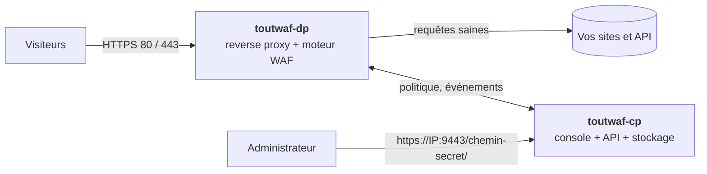

<div align="center">

# ToutWAF

**Pare-feu applicatif web (WAAP) auto-hébergé : protège vos sites et vos API, avec une console web en 10 langues.**

WAF · protection API · anti-bot · anti-DDoS couche 7 · reverse proxy · sauvegardes chiffrées

[Installer](#installation) · [Fonctionnalités](#fonctionnalités) · [Captures d'écran](#captures-décran) · [Architecture](#architecture) · [Premier démarrage](#premier-démarrage) · [English](README.en.md)

**Version 0.2.0-dev.8** · canal **bêta (dev)** · 2026-10-05

</div>


---

## C'est quoi ToutWAF ?

ToutWAF se place **devant vos sites web et vos API** et examine chaque requête avant qu'elle n'atteigne votre application : injections SQL, XSS, exécution de commandes, robots malveillants, attaques par volume, fuites de données dans les réponses… Les requêtes saines passent, les autres sont bloquées, et chaque décision est **expliquée** dans la console avec la règle déclenchée.

Il s'installe sur **votre propre serveur** (Linux ou Windows), sans service cloud : vos données de trafic restent chez vous.

> **Canal bêta.** Cette branche `dev` contient des versions de test (`X.Y.Z-dev.N`). Pour la production, utilisez la branche [`main`](https://github.com/qu3ntin01/toutwaf/tree/main) (canal stable).

> Ce dépôt publie uniquement les **installeurs et les binaires** de ToutWAF. Il ne contient pas de code source.

## Fonctionnalités

**Protection des applications web**
- Détection des injections SQL et NoSQL, XSS, injection de commandes, inclusion de fichiers et traversée de chemins, SSRF, XXE, injection de templates, désérialisation, Log4Shell et Spring4Shell, CRLF, *request smuggling*, envois de fichiers dangereux.
- Moteur de règles compatible avec le langage ModSecurity (SecLang), niveaux de paranoïa 1 à 4, notation d'anomalie, correctifs virtuels de CVE, règles personnalisées dans un langage lisible avec éditeur visuel.
- **Mode détection d'abord, blocage ensuite** : observez ce qui serait bloqué, créez des exceptions ciblées en un clic, simulez une règle avant de l'activer, déployez progressivement (1 % / 10 % / 100 %), et revenez en arrière en un clic.

**Protection des API**
- Validation OpenAPI et GraphQL, contrôle des JWT, clés d'API et quotas, limitation de débit par consommateur, détection de fuites de données (cartes bancaires, IBAN, clés secrètes) dans les réponses.

**Robots et attaques par volume**
- Score de robot, défi JavaScript invisible (preuve de travail), CAPTCHA intégré, empreintes TLS (JA3/JA4), robots légitimes vérifiés, politique pour les robots d'IA.
- Limitation de débit multi-critères, bannissement automatique progressif, mode « je suis attaqué », protections contre les connexions lentes et les abus HTTP/2.

**Contrôle d'accès**
- Listes d'IP et de réseaux, pays et ASN, réputation d'IP, Tor/VPN/hébergeurs, restriction des zones d'administration.

**Reverse proxy**
- TLS 1.2/1.3, HTTP/2, WebSocket, répartition de charge, contrôles de santé, cache, compression, certificats automatiques (Let's Encrypt / ZeroSSL).

**Console d'administration**
- **10 langues** (français, anglais, espagnol, allemand, italien, portugais, néerlandais, russe, chinois, arabe) ; **7 thèmes**, couleur d'accent personnalisable, aspect par défaut *Aurora* (clair, accent bleu, police Plus Jakarta Sans) et menu dont les sections démarrent repliées.
- Événements en direct avec recherche, explication de chaque décision, bouton « faux positif », versions de politique avec retour arrière, rôles et droits, authentification à deux facteurs, SSO, journal d'audit, API REST.
- Accès sécurisé : lien secret, lien d'installation à usage unique, compte et mot de passe modifiables.
- **Mises à jour du produit depuis la console** : choix du canal `stable` ou `dev`, avertissement immédiat (pastille de la barre du haut, bandeau, notification) dès qu'une version est publiée (vérification toutes les 5 minutes environ), notes de version, bouton **Mettre à jour maintenant** avec progression en direct ; si la nouvelle version ne démarre pas, la précédente est restaurée automatiquement.
- **Assistant de premier lancement** que l'on peut passer, avec une aide à côté du champ URL de l'origine et une **détection de la technologie** qui montre les couches trouvées (serveur web, langage, framework, CMS…), un niveau de confiance et les indices relevés pour chaque hypothèse.

**Exploitation**
- **Sauvegardes chiffrées** avec copies hors site (S3 compatible, SFTP, WebDAV), rétention et test de restauration automatique.
- Alertes et intégrations (SIEM, Slack, Teams, e-mail, PagerDuty…), métriques Prometheus, multi-organisations.
- **Pare-feu de l'hôte** : sous Linux, l'installeur ouvre les ports dont ToutWAF a besoin quand firewalld ou ufw est actif, et **Réglages → Pare-feu** affiche l'état de chaque port et ouvre ceux qui manquent.

## Captures d'écran

| | |
|---|---|
|  **Événements** : chaque requête, expliquée |  **Sites** : protection et score par site |
|  **Règles** : modes, exceptions, simulation |  **Sauvegardes** : chiffrées, copies hors site |
|  **Cluster** : vos serveurs, score de sécurité et alertes |  **Tableau de bord serveur** : ressources en direct, corrections, terminal |
|  **Assistant de configuration** : ports 80/443, certificats et moteur de proxy |  **Définitions** : 19 sources mises à jour automatiquement toutes les heures |

**Entièrement personnalisable : plusieurs thèmes, mode clair ou sombre, votre propre couleur d'accent** (Réglages → Apparence). L'apparence par défaut est *Aurora* en mode clair avec un accent bleu :


| Aurora (sombre) | Nordic | Exécutif |
|---|---|---|
|  |  |  |

| Obsidian | Ember |
|---|---|
|  |  |

> Captures réalisées avec des données de démonstration.

## Architecture



| Composant | Rôle |
|---|---|
| **`toutwaf-dp`** (data plane) | Reçoit le trafic, inspecte chaque requête et chaque réponse, applique la politique. Il **continue de protéger même si la console est arrêtée** (dernière politique en cache). |
| **`toutwaf-cp`** (control plane) | Console web, API REST, politiques versionnées, comptes et droits, événements, sauvegardes, certificats. |
| **`toutwafctl`** | Ligne de commande : sites, politiques, bannissements, sauvegardes, diagnostic. |

Un serveur suffit pour tout installer ; vous pouvez aussi placer plusieurs `toutwaf-dp` derrière un répartiteur, tous pilotés par un seul `toutwaf-cp`.

## Installation

### Prérequis

| | Linux | Windows |
|---|---|---|
| Système | x86_64 ou **ARM 64 bits (aarch64, Raspberry Pi 3/4/5 et Zero 2 W avec un OS 64 bits)**, avec systemd. **Validé** (x86_64) : AlmaLinux 10, Rocky Linux 9, Debian 12.. Le build arm64 n'est [pas encore testé sur du vrai matériel](#limites-connues) ; l'ARM 32 bits (armv7) n'est pas pris en charge | Windows 10/11 ou Windows Server, x64 ou **ARM64 (Windows sur ARM, jamais exécuté : build compilé en croisé et seulement vérifié par son en-tête PE)** (installeur [pas encore validé sur un vrai Windows](#limites-connues)) |
| Ressources | 1 Go de RAM, 2 Go de disque | idem |
| Droits | `root` (sudo) | PowerShell **administrateur** |
| Réseau | ports **80** et **443** libres (sites protégés), port **9443** (console) ; ouverts pour vous dans firewalld ou ufw, voir plus bas | idem (règles du Pare-feu Windows Defender créées par l'installeur) |
| Emplacement | un dossier unique, `/var/toutwaf` (`bin`, `conf`, `data`, `logs`), modifiable avec `--home DIR` | `%ProgramFiles%\ToutWAF`, données dans `%ProgramData%\ToutWAF` |

### Linux

```sh
curl -fsSL https://raw.githubusercontent.com/qu3ntin01/toutwaf/dev/install.sh | sudo bash
```

Un **menu interactif** s'affiche (installer, mettre à jour, désinstaller, état, afficher les liens), avec la description de chaque option. L'installeur télécharge les binaires, **vérifie leur empreinte SHA-256**, crée un utilisateur système dédié, installe les services `systemd` durcis, ouvre les ports du pare-feu (voir plus bas), puis affiche à la fin le **récapitulatif** (voir [Premier démarrage](#premier-démarrage)).

Installation sans interaction :

```sh
curl -fsSL https://raw.githubusercontent.com/qu3ntin01/toutwaf/dev/install.sh | sudo bash -s -- --install --yes --public-host waf.exemple.com --console-from 203.0.113.0/24
```

Options principales : `--component dp|cp|all`, `--channel stable|dev`, `--version X.Y.Z`, `--public-host`, `--home DIR`, `--no-firewall`, `--console-from CIDR`, `--lang fr`, `--tarball FICHIER` (hors ligne), `--dry-run`. Toutes les options : `install.sh --help`.

**Où vont les fichiers.** Une nouvelle installation Linux utilise un seul dossier, `/var/toutwaf`, avec `bin/`, `conf/`, `data/` et `logs/` dessous (`--home DIR` ou `TOUTWAF_HOME` pour en choisir un autre) ; les outils en ligne de commande (`toutwafctl`, `toutwaf-cp`, `toutwaf-dp`) sont liés dans `/usr/local/bin`. Une installation faite avant cette disposition garde ses chemins (`/etc/toutwaf`, `/var/lib/toutwaf`, `/var/log/toutwaf`, binaires dans `/usr/local/bin`) et n'est **jamais déplacée**.

**Pare-feu.** Quand firewalld ou ufw est actif, l'installeur ouvre par défaut ce dont les composants installés ont besoin : 80 et 443 pour un data plane, le port de la console (9443) pour un control plane. `--console-from CIDR` n'autorise que cette adresse ou ce réseau à joindre la console (`0.0.0.0/0` est refusé), et `--no-firewall` laisse le pare-feu tranquille. Le port 9444 des agents n'est **jamais** ouvert au public : autorisez-le seulement depuis vos propres serveurs. Sur les hôtes qui n'utilisent que nftables ou iptables, l'installeur ne modifie rien et affiche les commandes exactes. Ensuite, **Réglages → Pare-feu** dans la console montre les ports et peut ouvrir ceux qui manquent.

Pour raccorder un **serveur supplémentaire** (data plane seul) à une console existante :

```sh
curl -fsSL https://raw.githubusercontent.com/qu3ntin01/toutwaf/dev/install.sh | sudo bash -s -- --install --component dp --cp-url https://console.exemple.com:9444 --enroll-token JETON --yes
```

### Windows

Dans PowerShell, **en administrateur** :

```powershell
irm https://raw.githubusercontent.com/qu3ntin01/toutwaf/dev/install.ps1 | iex
```

Avec options :

```powershell
& ([scriptblock]::Create((irm https://raw.githubusercontent.com/qu3ntin01/toutwaf/dev/install.ps1))) -Install -PublicHost waf.exemple.com
```

### Mettre à jour, vérifier, désinstaller

```sh
curl -fsSL https://raw.githubusercontent.com/qu3ntin01/toutwaf/dev/install.sh | sudo bash -s -- --update      # met à jour (sauvegarde avant, retour arrière automatique si échec)
curl -fsSL https://raw.githubusercontent.com/qu3ntin01/toutwaf/dev/install.sh | sudo bash -s -- --status      # état de santé
curl -fsSL https://raw.githubusercontent.com/qu3ntin01/toutwaf/dev/install.sh | sudo bash -s -- --links       # réaffiche les liens d'accès
curl -fsSL https://raw.githubusercontent.com/qu3ntin01/toutwaf/dev/install.sh | sudo bash -s -- --uninstall   # désinstalle (ajoutez --purge pour tout effacer)
```

## Premier démarrage

À la fin de l'installation, l'installeur affiche un encadré avec tout ce qu'il faut :

1. **Le lien sécurisé de la console**, sous la forme `https://<IP>:9443/<chemin-secret>/`, donné pour **chaque adresse locale et pour l'adresse publique**. Le chemin secret est aléatoire : toute autre adresse du port 9443 renvoie une page 404 neutre.
2. **L'identifiant et le mot de passe** de l'administrateur, générés et **affichés une seule fois**.
3. **Un lien d'installation à usage unique** qui ouvre un assistant pour choisir votre propre lien secret, votre identifiant et votre mot de passe.
4. **Les ports** ouverts par l'installeur, et les commandes exactes pour ceux que vous devez ouvrir vous-même (nftables, iptables, `--no-firewall`). N'oubliez pas le groupe de sécurité de votre hébergeur.

Le même récapitulatif est enregistré dans `/var/toutwaf/conf/INSTALL-SUMMARY.txt` (lisible par `root` uniquement). Le lien secret, l'identifiant et le mot de passe se **changent ensuite dans Réglages → Accès** et **Mon compte**.

| Port | Usage | À ouvrir ? |
|---|---|---|
| 80 et 443 / TCP | Trafic des sites protégés (`toutwaf-dp`) | Oui |
| 9443 / TCP | Console d'administration (`toutwaf-cp`) | Ouvert par l'installeur ; idéalement limité à votre réseau d'administration (`--console-from`) |
| 9444 / TCP | Raccordement de serveurs `toutwaf-dp` distants et d'agents d'hôte | Jamais ouvert au public par l'installeur : autorisez-le seulement depuis vos propres serveurs |

**Protéger votre premier site, en 5 minutes :**

1. Ouvrez la console et suivez l'assistant (ou passez-le et ajoutez un site plus tard depuis **Sites**) : saisissez le **domaine** et l'adresse de votre **serveur d'origine** ; l'aide à côté de ce champ donne des exemples.
2. ToutWAF détecte votre technologie (couches, confiance, indices), propose un modèle de politique adapté, et offre un **certificat gratuit** (Let's Encrypt).
3. Le site démarre en **mode détection** : rien n'est bloqué, tout est observé.
4. Faites pointer votre DNS vers ToutWAF, laissez tourner quelques jours, consultez le **rapport** (ce qui aurait été bloqué, les faux positifs probables, les exceptions proposées).
5. Passez en **mode blocage** en un clic, avec retour arrière en un clic.

Commandes utiles : `toutwafctl doctor` (diagnostic), `toutwaf-cp admin reset-password --user admin` (mot de passe oublié), `toutwaf-cp setup-link --regenerate` (nouveau lien d'installation).

## Canaux : stable et bêta

| Canal | Branche | Pour qui | Installation par défaut |
|---|---|---|---|
| **stable** | [`main`](https://github.com/qu3ntin01/toutwaf/tree/main) | production | `…/main/install.sh` |
| **bêta (dev)** | [`dev`](https://github.com/qu3ntin01/toutwaf/tree/dev) | tests, nouveautés | `…/dev/install.sh` |

L'installeur retient le canal choisi (`<home>/conf/installer.conf`) ; `--channel stable|dev` permet d'en changer. Le canal peut aussi se choisir sur la page **Mises à jour** de la console.

### Mettre à jour depuis la console

La page **Mises à jour** (menu Administration) affiche la version installée, la dernière version du canal choisi et ses notes de version. Le control plane interroge le canal toutes les 5 minutes environ et la console annonce aussitôt une nouvelle version. **Mettre à jour maintenant** télécharge la version, vérifie son empreinte, l'installe et redémarre les services **de ce serveur**, avec une progression en direct ; si la nouvelle version ne démarre pas, la précédente est restaurée automatiquement. Rien n'est proposé quand le canal est plus ancien que la version installée (pas de rétrogradation silencieuse). Les autres serveurs data plane se mettent à jour par les campagnes progressives de la console ou en relançant l'installeur dessus.

## Édition gratuite

Sans licence, ToutWAF fonctionne en **édition gratuite** : **5 sites protégés, 1 nœud, 2 utilisateurs, 1 organisation et 50 millions de requêtes par mois**. Dépasser le quota mensuel est signalé « hors quota » dans la console. Au-delà, l'ajout est refusé tant qu'aucune licence n'est installée. Tout le reste décrit ici est le même produit ; pour des limites plus élevées, contactez votre fournisseur ToutWAF.

## Limites connues

Soyons transparents sur ce qui n'est pas (encore) couvert :

- **Plateformes** : installation validée de bout en bout sur AlmaLinux 10, Rocky Linux 9 et Debian 12 avec les binaires de cette version ; AlmaLinux 9 et Ubuntu 24.04 ont passé les essais précédents sur une version antérieure. Les autres distributions ne sont pas testées. **Windows** : l'agent d'hôte (cluster) est testé sur un vrai Windows Server 2025 (audit, mesures, scan Microsoft Defender, terminal) ; le script d'installation Windows lui-même n'est pas encore validé de bout en bout sur un vrai poste. **ARM64 (Raspberry Pi, Graviton, Ampere)** : la release contient un paquet linux-arm64, compilé en croisé et vérifié uniquement sous émulation (QEMU) : démarrage, sondes de santé, requête proxifiée, injection SQL bloquée. Il n'a **pas été testé sur du vrai matériel ARM** et aucun chiffre de performance n'est donné. Un Raspberry Pi demande un OS **64 bits** (Raspberry Pi OS 64 bits, Ubuntu ou Debian arm64) ; l'ARM 32 bits (armv7, Raspberry Pi OS 32 bits) n'est pas pris en charge et l'installeur s'arrête avec un message. **Windows sur ARM64** : la release contient un paquet windows-arm64 (compilé en croisé ; seul le type de machine PE 0xAA64 a été vérifié), il n'a jamais été exécuté sous Windows sur ARM.
- **Mises à jour depuis la console** : elles s'installent sur le serveur qui héberge la console, sous Linux avec systemd uniquement (ailleurs, par exemple sous Windows, la page affiche la commande à lancer) ; les autres nœuds suivent par les campagnes de mise à jour ou l'installeur. **Automatisation du pare-feu** : firewalld et ufw (et les règles du Pare-feu Windows Defender créées par l'installeur) ; avec nftables ou iptables, vous obtenez les commandes à lancer.
- **Pas encore disponible** : HTTP/3, base de données PostgreSQL (SQLite uniquement), inspection du contenu des messages gRPC.
- **Peu éprouvé** : SSO SAML (OIDC testé), téléchargement automatique toutes les heures des versions d'OWASP CRS depuis GitHub sur plusieurs jours (le jeu CRS 4.31 complet est, lui, testé dans notre banc), certificats DNS-01 chez Cloudflare/OVH/Route 53, intégrations tierces (SIEM, tickets).
- **Détection** : mesurée avec un outil indépendant (GoTestWAF : 673/673 attaques bloquées, 0/141 faux positifs) et sur un jeu de charges publiques jamais vu pendant le développement (89,9 % en brut ; 99,95 % une fois écartés les fragments de bruit qui ne sont pas des attaques, liste communiquée à nos relecteurs). Aucun WAF n'attrape tout : prévoyez d'ajuster des exceptions pour vos applications. Compromis connus : opérateurs de type MongoDB (`$ne`, `$where`) dans les champs JSON/formulaire et deux `../` ou plus dans une valeur sont bloqués.
- **Performances** : mesurées sur une machine de test partagée (quelques milliers de requêtes par seconde par instance). Pour votre charge, mesurez sur votre matériel avant la mise en production.
- Les traductions de la console et des messages d'erreur ont été rédigées avec l'aide d'outils automatiques et n'ont pas encore été relues par des locuteurs natifs.
- Aucune certification (ANSSI, PCI DSS, ISO 27001) n'est revendiquée.


## Versions et téléchargements

**Version 0.2.0-dev.8**

| Fichier | Système | Architecture | Taille | SHA-256 |
|---|---|---|---:|---|
| `toutwaf-linux-amd64.tar.gz` | linux | amd64 | 42.5 MiB | `a9429bd7036ec2f045eacc33448153971c941c964691a4b8a668a64cbc52ffe2` |
| `toutwaf-linux-arm64.tar.gz` | linux | arm64 | 38.8 MiB | `a08b89a34cc25e3df1830d07251a2b0f2a2667a9af646c817f93b89871c9905e` |
| `toutwaf-windows-amd64.zip` | windows | amd64 | 43.0 MiB | `258b13ba5fc491637202932874c3167a0dbf1671cb4d8e212f01ac1b43c6074c` |
| `toutwaf-windows-arm64.zip` | windows | arm64 | 39.1 MiB | `d41bfce2fe64f3645d7cd7a1e07e4d0c3ddba07b90b73992e8f030ae42361a4c` |


| Version | Date | Statut | Dossier |
|---|---|---|---|
| `0.2.0-dev.8` | 2026-10-05T17:24:59Z | **actuelle** | `releases/0.2.0-dev.8/` |
| `0.2.0-dev.7` | 2026-10-05T14:28:05Z | disponible | `releases/0.2.0-dev.7/` |
| `0.2.0-dev.6` | 2026-10-04T18:03:29Z | disponible | `releases/0.2.0-dev.6/` |
| `0.2.0-dev.5` | 2026-10-03T17:20:42Z | disponible | `releases/0.2.0-dev.5/` |
| `0.2.0-dev.4` | 2026-10-03T13:59:43Z | disponible | `releases/0.2.0-dev.4/` |

Les notes de chaque version sont dans [CHANGELOG.md](CHANGELOG.md).

### Vérifier un téléchargement

Chaque dossier de version contient un fichier `SHA256SUMS` ; `channel.json` répète les empreintes de la version courante. L'installeur les vérifie automatiquement. Pour vérifier à la main :

```sh
cd releases/0.2.0-dev.8 && sha256sum -c SHA256SUMS --ignore-missing
```

### Vérifier une version

À partir de la version 0.2.0-dev.7, chaque dossier de version contient aussi `SHA256SUMS.sig` : le base64 de la signature Ed25519 brute (64 octets) du fichier `SHA256SUMS` exact. Les installeurs la vérifient par défaut avec une clé publique intégrée au script d'installation (identifiant `f8fc98e4c6e364fa`) et refusent une version dont la signature est invalide, ou absente pour 0.2.0-dev.7 et suivantes ; les versions antérieures à 0.2.0-dev.7 ont été publiées sans signature (empreintes seulement). La clé publique répétée dans `channel.json` est informative et ne sert jamais à faire confiance à une version : prenez la clé dans le script d'installation ou auprès de votre éditeur. Clé publique (brute, base64) : `PAevMh9+at71+DR2Tnmo2raHB5mgvltMCUds8nevudo=`. Pour vérifier à la main (OpenSSL 3 ou plus) :

```sh
V=0.2.0-dev.8; R=https://raw.githubusercontent.com/qu3ntin01/toutwaf/dev/releases/$V
curl -fsSLO "$R/SHA256SUMS" -O "$R/SHA256SUMS.sig"
{ printf '\x30\x2a\x30\x05\x06\x03\x2b\x65\x70\x03\x21\x00'; echo 'PAevMh9+at71+DR2Tnmo2raHB5mgvltMCUds8nevudo=' | base64 -d; } | openssl pkey -pubin -inform DER -out release.pem
base64 -d SHA256SUMS.sig > sig.bin
openssl pkeyutl -verify -pubin -inkey release.pem -rawin -in SHA256SUMS -sigfile sig.bin   # « Signature Verified Successfully »
sha256sum -c SHA256SUMS --ignore-missing
```

Une version signée avec une autre clé, ou modifiée après la signature, échoue avec « Signature Verification Failure ». Pour faire confiance à une autre clé (miroir privé), définissez `TOUTWAF_RELEASE_PUBKEY` ou créez `<home>/conf/release.pub` avant l'installation.

## Licence et support

ToutWAF est un logiciel propriétaire : voir [LICENSE](LICENSE). Pour le support, la licence commerciale ou un signalement de sécurité, contactez votre fournisseur ToutWAF.
