<div align="center">

# ToutWAF

**Pare-feu applicatif web (WAAP) auto-hébergé : protège vos sites et vos API, avec une console web en 10 langues.**

WAF · protection API · anti-bot · anti-DDoS couche 7 · reverse proxy · sauvegardes chiffrées

[Installer](#installation) · [Fonctionnalités](#fonctionnalités) · [Captures d'écran](#captures-décran) · [Architecture](#architecture) · [Premier démarrage](#premier-démarrage) · [English](README.en.md)

**Version 0.2.0-dev.4** · canal **stable** · 2026-10-03

</div>

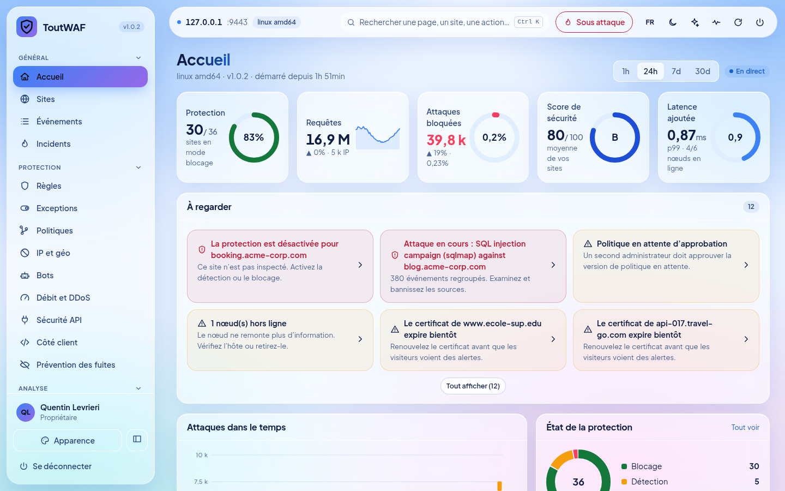

---

## C'est quoi ToutWAF ?

ToutWAF se place **devant vos sites web et vos API** et examine chaque requête avant qu'elle n'atteigne votre application : injections SQL, XSS, exécution de commandes, robots malveillants, attaques par volume, fuites de données dans les réponses… Les requêtes saines passent, les autres sont bloquées, et chaque décision est **expliquée** dans la console avec la règle déclenchée.

Il s'installe sur **votre propre serveur** (Linux ou Windows), sans service cloud : vos données de trafic restent chez vous.

> **Canal stable.** Les versions de test sont sur la branche [`dev`](https://github.com/qu3ntin01/toutwaf/tree/dev).

> Ce dépôt publie uniquement les **installeurs et les binaires** de ToutWAF. Il ne contient pas de code source.

## Fonctionnalités

**Protection des applications web**
- Détection des injections SQL et NoSQL, XSS, injection de commandes, inclusion de fichiers et traversée de chemins, SSRF, XXE, injection de templates, désérialisation, Log4Shell et Spring4Shell, CRLF, *request smuggling*, envois de fichiers dangereux.
- Moteur de règles compatible avec le langage ModSecurity (SecLang), niveaux de paranoïa 1 à 4, notation d'anomalie, correctifs virtuels de CVE, règles personnalisées dans un langage lisible avec éditeur visuel.
- **Mode détection d'abord, blocage ensuite** : observez ce qui serait bloqué, créez des exceptions ciblées en un clic, simulez une règle avant de l'activer, déployez progressivement (1 % / 10 % / 100 %), et revenez en arrière en un clic.

**Protection des API**
- Validation OpenAPI et GraphQL, contrôle des JWT, clés d'API et quotas, limitation de débit par consommateur, détection de fuites de données (cartes bancaires, IBAN, clés secrètes) dans les réponses.

**Robots et attaques par volume**
- Score de robot, défi JavaScript invisible (preuve de travail), CAPTCHA intégré, empreintes TLS (JA3/JA4), robots légitimes vérifiés, politique pour les robots d'IA.
- Limitation de débit multi-critères, bannissement automatique progressif, mode « je suis attaqué », protections contre les connexions lentes et les abus HTTP/2.

**Contrôle d'accès**
- Listes d'IP et de réseaux, pays et ASN, réputation d'IP, Tor/VPN/hébergeurs, restriction des zones d'administration.

**Reverse proxy**
- TLS 1.2/1.3, HTTP/2, WebSocket, répartition de charge, contrôles de santé, cache, compression, certificats automatiques (Let's Encrypt / ZeroSSL).

**Console d'administration**
- **10 langues** (français, anglais, espagnol, allemand, italien, portugais, néerlandais, russe, chinois, arabe) ; **7 thèmes** et couleur d'accent au choix.
- Événements en direct avec recherche, explication de chaque décision, bouton « faux positif », versions de politique avec retour arrière, rôles et droits, authentification à deux facteurs, SSO, journal d'audit, API REST.
- Accès sécurisé : lien secret, lien d'installation à usage unique, compte et mot de passe modifiables.

**Exploitation**
- **Sauvegardes chiffrées** avec copies hors site (S3 compatible, SFTP, WebDAV), rétention et test de restauration automatique.
- Alertes et intégrations (SIEM, Slack, Teams, e-mail, PagerDuty…), métriques Prometheus, multi-organisations.

## Captures d'écran

| | |
|---|---|
| 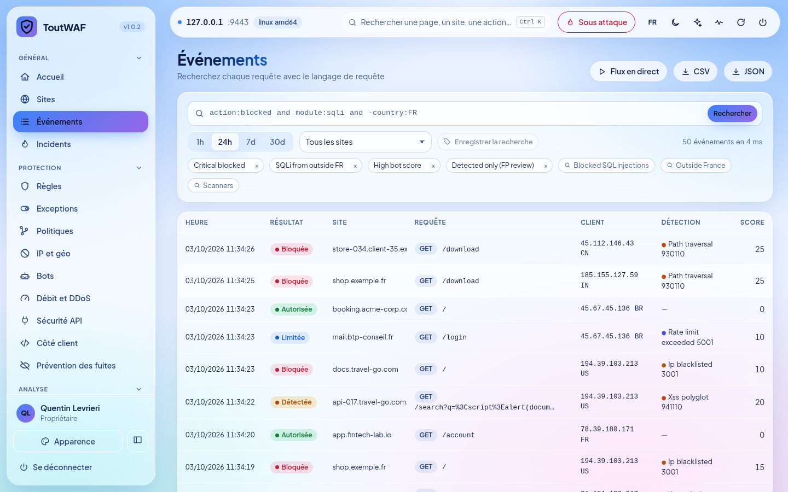 **Événements** : chaque requête, expliquée | 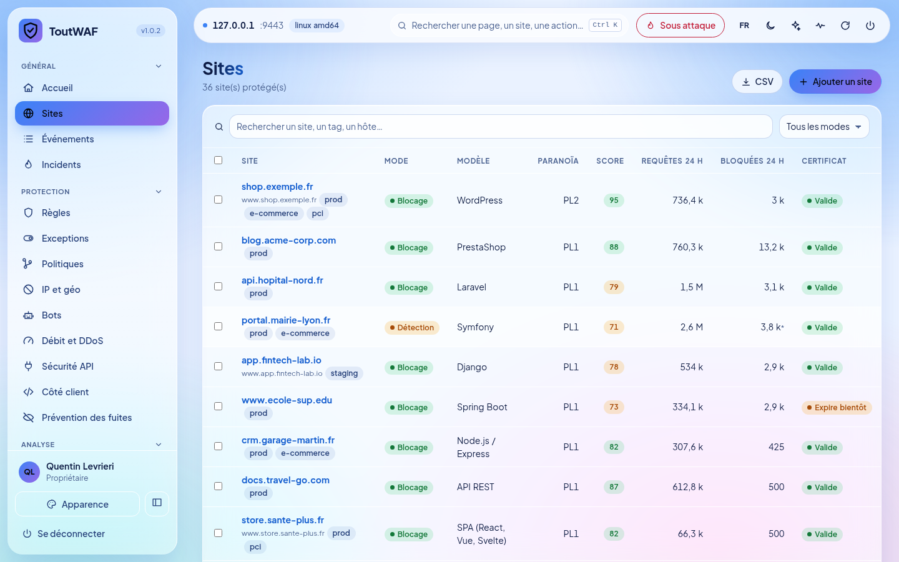 **Sites** : protection et score par site |
| 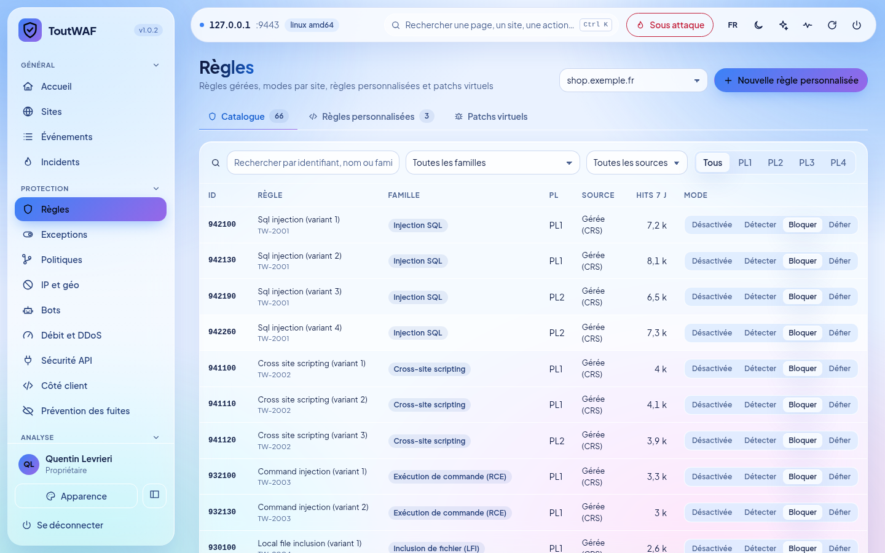 **Règles** : modes, exceptions, simulation | 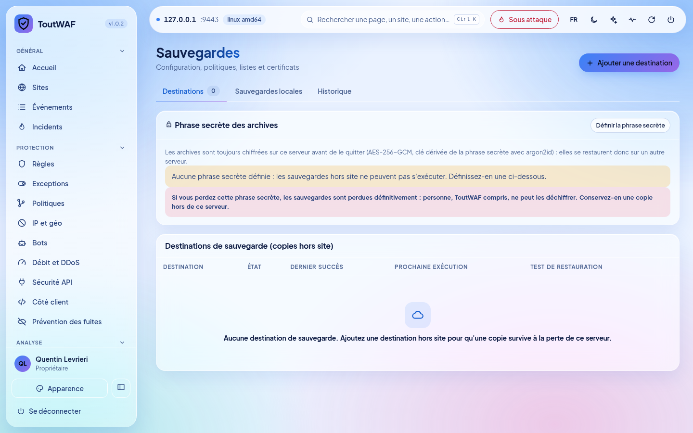 **Sauvegardes** : chiffrées, copies hors site |
| 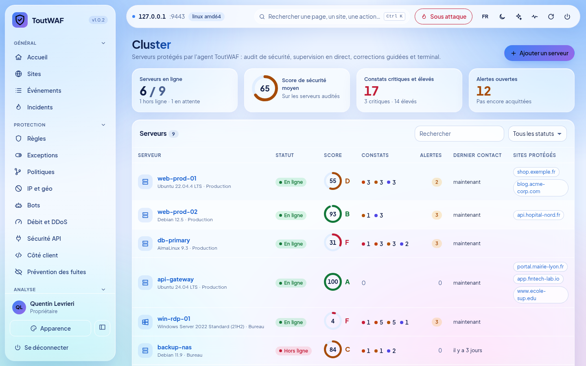 **Cluster** : vos serveurs, score de sécurité et alertes | 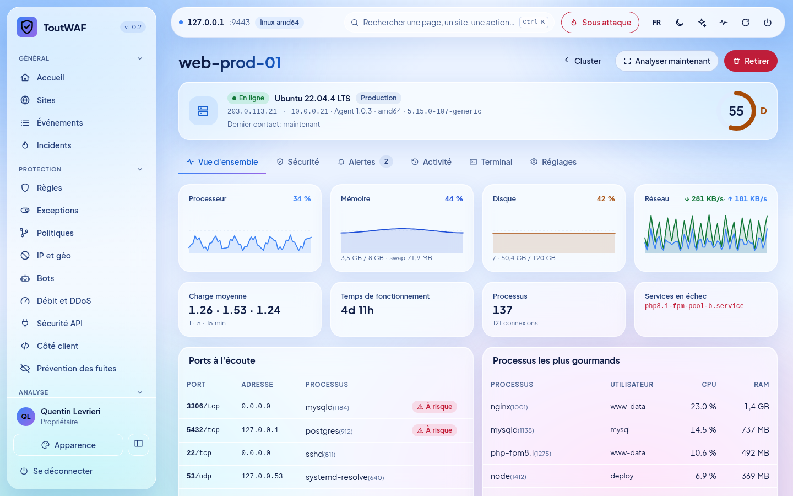 **Tableau de bord serveur** : ressources en direct, corrections, terminal |
| 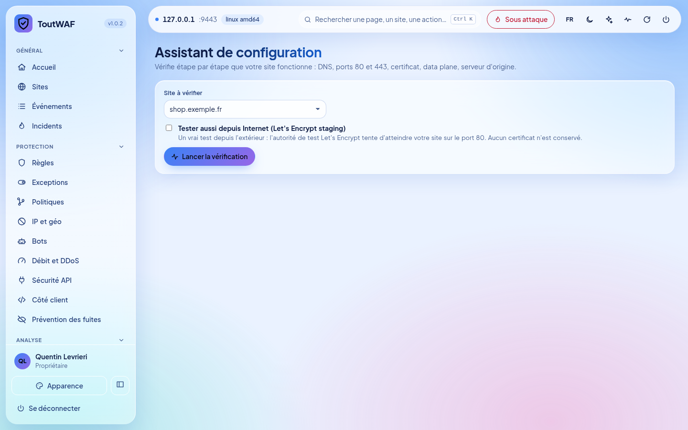 **Assistant de configuration** : ports 80/443, certificats et moteur de proxy | 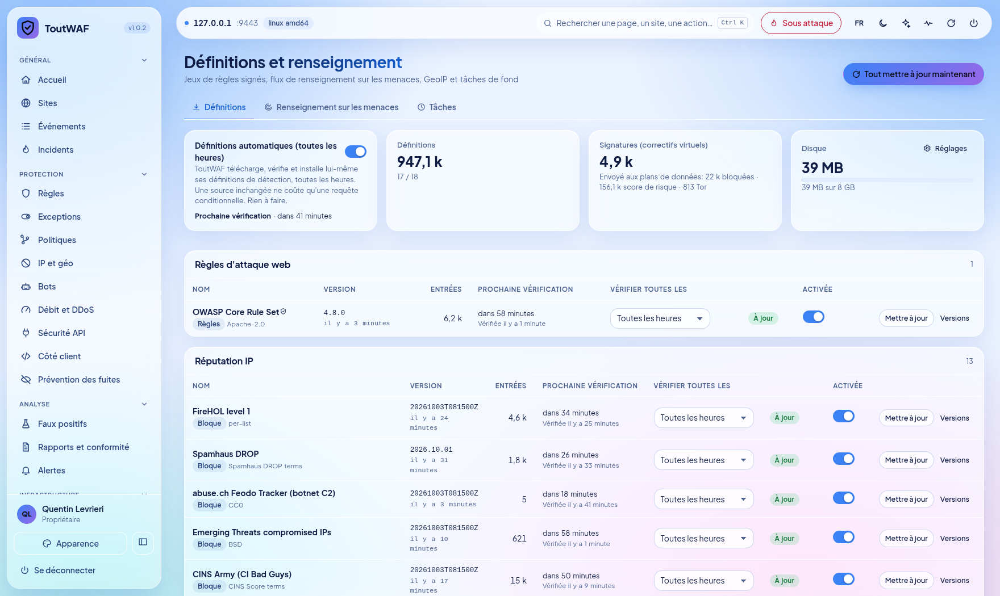 **Définitions** : 19 sources mises à jour automatiquement toutes les heures |

**Entièrement personnalisable : plusieurs thèmes, mode clair ou sombre, votre propre couleur d'accent** (Réglages → Apparence). L'apparence par défaut est *Aurora* en mode clair avec un accent bleu :

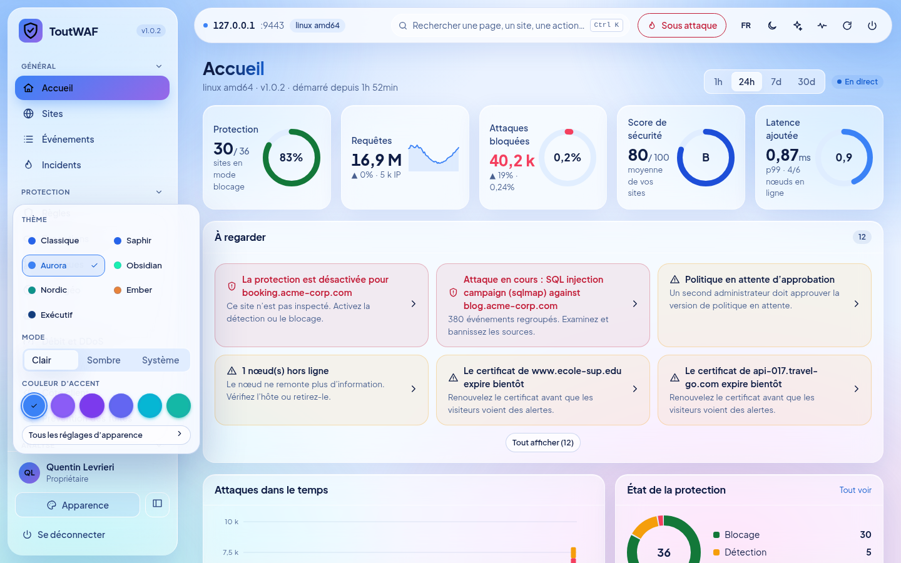

| Aurora (sombre) | Nordic | Exécutif |
|---|---|---|
| 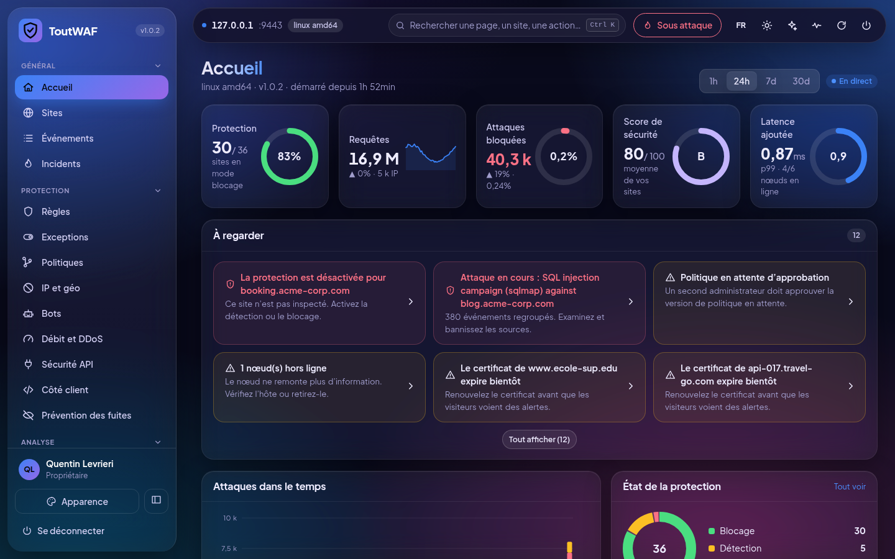 | 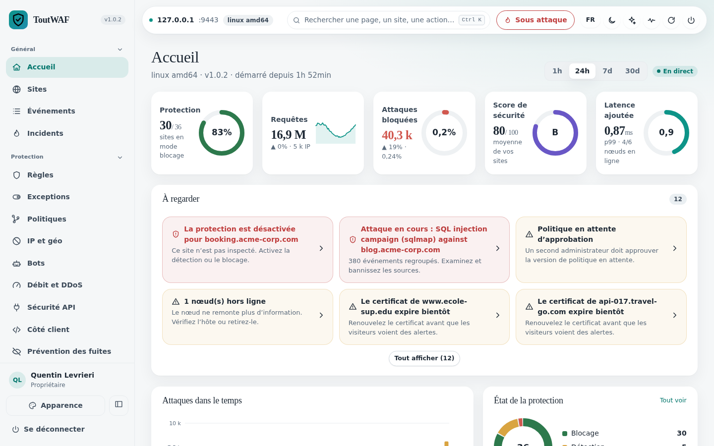 | 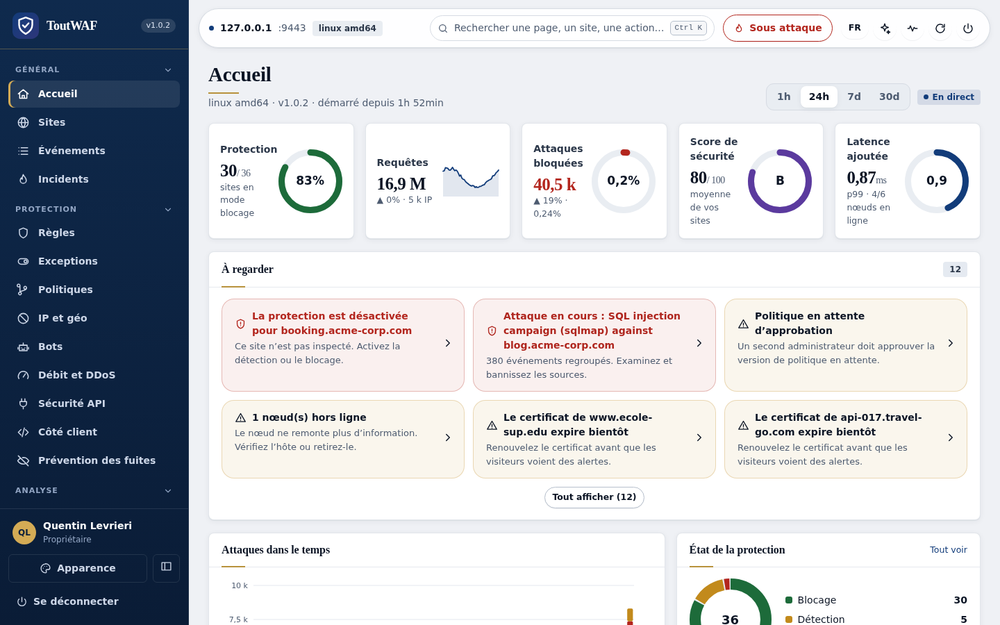 |

| Obsidian | Ember |
|---|---|
| 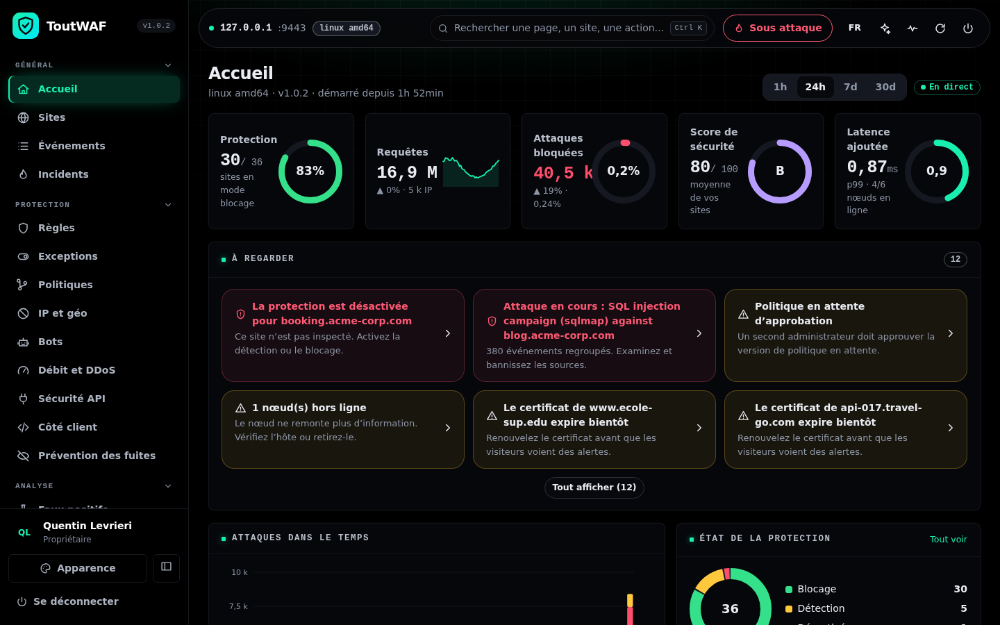 | 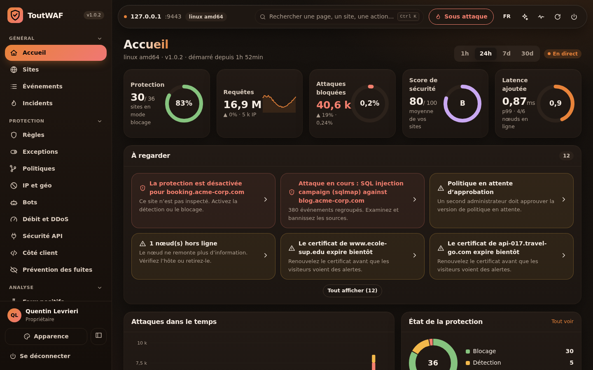 |

> Captures réalisées avec des données de démonstration.

## Architecture

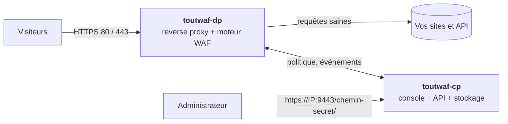

| Composant | Rôle |
|---|---|
| **`toutwaf-dp`** (data plane) | Reçoit le trafic, inspecte chaque requête et chaque réponse, applique la politique. Il **continue de protéger même si la console est arrêtée** (dernière politique en cache). |
| **`toutwaf-cp`** (control plane) | Console web, API REST, politiques versionnées, comptes et droits, événements, sauvegardes, certificats. |
| **`toutwafctl`** | Ligne de commande : sites, politiques, bannissements, sauvegardes, diagnostic. |

Un serveur suffit pour tout installer ; vous pouvez aussi placer plusieurs `toutwaf-dp` derrière un répartiteur, tous pilotés par un seul `toutwaf-cp`.

## Installation

### Prérequis

| | Linux | Windows |
|---|---|---|
| Système | x86_64 avec systemd. **Validé** : AlmaLinux 10, Rocky Linux 9, Debian 12. | Windows 10/11 ou Windows Server, x64 (installeur [pas encore validé sur un vrai Windows](#limites-connues)) |
| Ressources | 1 Go de RAM, 2 Go de disque | idem |
| Droits | `root` (sudo) | PowerShell **administrateur** |
| Réseau | ports **80** et **443** libres (sites protégés), port **9443** (console) | idem |

### Linux

```sh
curl -fsSL https://raw.githubusercontent.com/qu3ntin01/toutwaf/main/install.sh | sudo bash
```

Un **menu interactif** s'affiche (installer, mettre à jour, désinstaller, état, afficher les liens), avec la description de chaque option. L'installeur télécharge les binaires, **vérifie leur empreinte SHA-256**, crée un utilisateur système dédié, installe les services `systemd` durcis, règle le pare-feu si vous l'acceptez, puis affiche à la fin le **récapitulatif** (voir [Premier démarrage](#premier-démarrage)).

Installation sans interaction :

```sh
curl -fsSL https://raw.githubusercontent.com/qu3ntin01/toutwaf/main/install.sh | sudo bash -s -- --install --yes --public-host waf.exemple.com --open-firewall
```

Options principales : `--component dp|cp|all`, `--channel stable|dev`, `--version X.Y.Z`, `--public-host`, `--open-firewall`, `--lang fr`, `--tarball FICHIER` (hors ligne), `--dry-run`. Toutes les options : `install.sh --help`.

Pour raccorder un **serveur supplémentaire** (data plane seul) à une console existante :

```sh
curl -fsSL https://raw.githubusercontent.com/qu3ntin01/toutwaf/main/install.sh | sudo bash -s -- --install --component dp --cp-url https://console.exemple.com:9444 --enroll-token JETON --yes
```

### Windows

Dans PowerShell, **en administrateur** :

```powershell
irm https://raw.githubusercontent.com/qu3ntin01/toutwaf/main/install.ps1 | iex
```

Avec options :

```powershell
& ([scriptblock]::Create((irm https://raw.githubusercontent.com/qu3ntin01/toutwaf/main/install.ps1))) -Install -PublicHost waf.exemple.com
```

### Mettre à jour, vérifier, désinstaller

```sh
curl -fsSL https://raw.githubusercontent.com/qu3ntin01/toutwaf/main/install.sh | sudo bash -s -- --update      # met à jour (sauvegarde avant, retour arrière automatique si échec)
curl -fsSL https://raw.githubusercontent.com/qu3ntin01/toutwaf/main/install.sh | sudo bash -s -- --status      # état de santé
curl -fsSL https://raw.githubusercontent.com/qu3ntin01/toutwaf/main/install.sh | sudo bash -s -- --links       # réaffiche les liens d'accès
curl -fsSL https://raw.githubusercontent.com/qu3ntin01/toutwaf/main/install.sh | sudo bash -s -- --uninstall   # désinstalle (ajoutez --purge pour tout effacer)
```

## Premier démarrage

À la fin de l'installation, l'installeur affiche un encadré avec tout ce qu'il faut :

1. **Le lien sécurisé de la console**, sous la forme `https://<IP>:9443/<chemin-secret>/`, donné pour **chaque adresse locale et pour l'adresse publique**. Le chemin secret est aléatoire : toute autre adresse du port 9443 renvoie une page 404 neutre.
2. **L'identifiant et le mot de passe** de l'administrateur, générés et **affichés une seule fois**.
3. **Un lien d'installation à usage unique** qui ouvre un assistant pour choisir votre propre lien secret, votre identifiant et votre mot de passe.
4. **Les ports à ouvrir** dans le pare-feu, avec les commandes exactes (`firewalld`, `ufw`, Windows). N'oubliez pas le groupe de sécurité de votre hébergeur.

Le même récapitulatif est enregistré dans `/etc/toutwaf/INSTALL-SUMMARY.txt` (lisible par `root` uniquement). Le lien secret, l'identifiant et le mot de passe se **changent ensuite dans Réglages → Accès** et **Mon compte**.

| Port | Usage | À ouvrir ? |
|---|---|---|
| 80 et 443 / TCP | Trafic des sites protégés (`toutwaf-dp`) | Oui |
| 9443 / TCP | Console d'administration (`toutwaf-cp`) | Oui, idéalement limité à votre réseau d'administration |
| 9444 / TCP | Raccordement de serveurs `toutwaf-dp` distants | Seulement si le data plane est sur une autre machine |

**Protéger votre premier site, en 5 minutes :**

1. Ouvrez la console et suivez l'assistant : saisissez le **domaine** et l'adresse de votre **serveur d'origine**.
2. ToutWAF propose un **certificat gratuit** (Let's Encrypt) et un modèle de politique adapté à votre technologie.
3. Le site démarre en **mode détection** : rien n'est bloqué, tout est observé.
4. Faites pointer votre DNS vers ToutWAF, laissez tourner quelques jours, consultez le **rapport** (ce qui aurait été bloqué, les faux positifs probables, les exceptions proposées).
5. Passez en **mode blocage** en un clic, avec retour arrière en un clic.

Commandes utiles : `toutwafctl doctor` (diagnostic), `toutwaf-cp admin reset-password --user admin` (mot de passe oublié), `toutwaf-cp setup-link --regenerate` (nouveau lien d'installation).

## Canaux : stable et bêta

| Canal | Branche | Pour qui | Installation par défaut |
|---|---|---|---|
| **stable** | [`main`](https://github.com/qu3ntin01/toutwaf/tree/main) | production | `…/main/install.sh` |
| **bêta (dev)** | [`dev`](https://github.com/qu3ntin01/toutwaf/tree/dev) | tests, nouveautés | `…/dev/install.sh` |

L'installeur retient le canal choisi (`/etc/toutwaf/installer.conf`) ; `--channel stable|dev` permet d'en changer. La console indique quand une version plus récente est disponible.

## Limites connues

Soyons transparents sur ce qui n'est pas (encore) couvert :

- **Plateformes** : installation validée de bout en bout sur AlmaLinux 10, Rocky Linux 9 et Debian 12 avec les binaires de cette version ; AlmaLinux 9 et Ubuntu 24.04 ont passé les essais précédents sur une version antérieure. Les autres distributions ne sont pas testées. **Windows** : l'agent d'hôte (cluster) est testé sur un vrai Windows Server 2025 (audit, mesures, scan Microsoft Defender, terminal) ; le script d'installation Windows lui-même n'est pas encore validé de bout en bout sur un vrai poste. **Aucun paquet ARM64** pour l'instant.
- **Pas encore disponible** : HTTP/3, base de données PostgreSQL (SQLite uniquement), inspection du contenu des messages gRPC.
- **Peu éprouvé** : SSO SAML (OIDC testé), téléchargement automatique toutes les heures des versions d'OWASP CRS depuis GitHub sur plusieurs jours (le jeu CRS 4.31 complet est, lui, testé dans notre banc), certificats DNS-01 chez Cloudflare/OVH/Route 53, intégrations tierces (SIEM, tickets).
- **Détection** : mesurée avec un outil indépendant (GoTestWAF : 673/673 attaques bloquées, 0/141 faux positifs) et sur un jeu de charges publiques jamais vu pendant le développement (89,9 % en brut ; 99,95 % une fois écartés les fragments de bruit qui ne sont pas des attaques, liste communiquée à nos relecteurs). Aucun WAF n'attrape tout : prévoyez d'ajuster des exceptions pour vos applications. Compromis connus : opérateurs de type MongoDB (`$ne`, `$where`) dans les champs JSON/formulaire et deux `../` ou plus dans une valeur sont bloqués.
- **Performances** : mesurées sur une machine de test partagée (quelques milliers de requêtes par seconde par instance). Pour votre charge, mesurez sur votre matériel avant la mise en production.
- Les traductions de la console et des messages d'erreur ont été rédigées avec l'aide d'outils automatiques et n'ont pas encore été relues par des locuteurs natifs.
- Aucune certification (ANSSI, PCI DSS, ISO 27001) n'est revendiquée.

Cibles non compilées pour cette version :
- `linux-arm64` : rust target aarch64-unknown-linux-gnu not installed (rustup target add aarch64-unknown-linux-gnu)

## Versions et téléchargements

**Version 0.2.0-dev.4**

| Fichier | Système | Architecture | Taille | SHA-256 |
|---|---|---|---:|---|
| `toutwaf-linux-amd64.tar.gz` | linux | amd64 | 38.7 MiB | `2eba29ebaf27b60b186d8150e2a85e6795e1a49d3e06e2afbf6c7c139b9c48f3` |
| `toutwaf-windows-amd64.zip` | windows | amd64 | 39.3 MiB | `bb98a3496e8e2d29c5d7ea1b679362f60f4c58ffa66ae4d6fae11b2c17e03491` |


| Version | Date | Statut | Dossier |
|---|---|---|---|
| `0.2.0-dev.4` | 2026-10-03T13:59:43Z | **actuelle** | `releases/0.2.0-dev.4/` |
| `0.2.0-dev.1` | 2026-10-02T14:59:13Z | disponible | `releases/0.2.0-dev.1/` |

Les notes de chaque version sont dans [CHANGELOG.md](CHANGELOG.md).

### Vérifier un téléchargement

Chaque dossier de version contient un fichier `SHA256SUMS` ; `channel.json` répète les empreintes de la version courante. L'installeur les vérifie automatiquement. Pour vérifier à la main :

```sh
cd releases/0.2.0-dev.4 && sha256sum -c SHA256SUMS --ignore-missing
```

Cette version n'est pas encore signée par clé : fiez-vous aux empreintes SHA-256 ci-dessus.

## Licence et support

ToutWAF est un logiciel propriétaire : voir [LICENSE](LICENSE). Pour le support, la licence commerciale ou un signalement de sécurité, contactez votre fournisseur ToutWAF.
